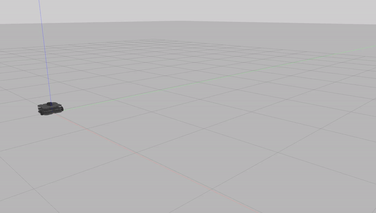
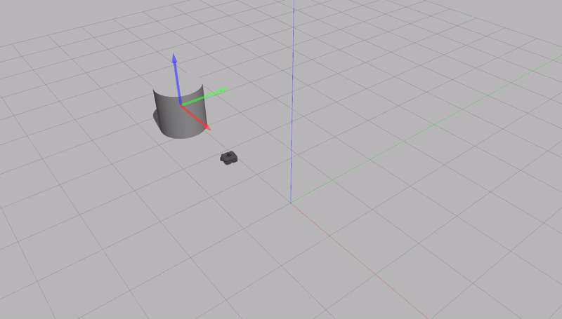

# Driving in a Square

**Description:**

My approach consisted of moving the robot straight and taking 90 degree turns successively. Going straight and turning 4 times makes the robot travel in a square. Every straight and turning movement has the same speed and duration, which ensures that the path is a square.

**Code Explanation:**

* The init method initializes the publisher and the velocity message.
* The go_for_duration() method takes a duration argument and publishes a velocity message for that duration. It checks the publisher's connections to make sure that no message is wasted.
* go_straight() method makes the robot travel on a straight line for 5 seconds at 0.3 speed by setting the linear twist parameter and publishing using the go_for_duration method.
* turn90() method makes the robot turn 90 degrees anticlockwise. It turns in 4 seconds and the angular velocity is calculated by pi/(2*duration) since pi/2 is 90 degrees. This again uses the go_for_duration method to publish the velocity message.
* In the run() method we go straight and turn four times to complete a square.

# Person Follower

**Description:**

Whenever there is a Lidar reading, I process the reading and determine where the person is located based on the angle of the minimum reading. If the person is in front, I move forward. If the person is to the either side, I give angular velocity. If the person is behind, I stop and give angular velocity to not get out of scan range. 

**Code Explanation:**
* The `init` method initializes the velocity publisher and scan subscriber.
* The `process_scan()` method processes the Lidar scan value and determines the location of the person. It sets the state of the vehicle accordingly. The states are stop, front, left, right, behind_left and behind_right. 360 degrees is partitioned to regions to accomodate these states as can be seen from the first if statements. For example 25 to 135 degrees is left. 
* `run()` method runs the person follower. If the person is too close, it stops. If the person is in front, it follows. If the person is to the sides, it turns. If the person is behind, it stops and turns. 

# Wall Follower

**Description:**
I programmed the robot to keep the wall on its right. When there is a Lidar scan, I process the scanning data and set the state of the vehicle. There are 3 states. Find wall, follow wall, and turn. Follow wall uses error = 0.6 - distance to keep from at a 0.6 distance from the wall. 

**Code Explanation:**
* `init` initializes the velocity publisher and the scan subscriber.
* `process_scan()` processes the Lidar data and sets the state of the vehicle. If there is a close reading in front, it sets the state to turn. If there is a wall on the right closeby, it sets the state to follow wall. If the robot is in neither of these states, it is in find wall mode.
* `run()` runs the wall follower. When the state is find wall, it sets a forward velocity. When the state is turn, it stops and sets and angular velocity. If the state is follow wall, it sets an error to keep its distance from the wall. 

**Challenges:**

In the first problem, the main challenge I changed was in trying to make the robot turn 90 degrees. For this to happen, the robot has to set a precise velocity for a precise duration. I noticed that even though the formulas were correct, the robot was not turning a full 90 degrees. It turned out that it takes a while for the publisher to establish a connection, which messes with the turning time duration. I fixed this by checking that a connection is made before making the robot turn. This ensured a precise 90 degree turn. In the person follower, the main problem was partitioning the angles from the scanner right. I found a good partition using trial and error. In the wall follower, I had a hard time keeping at a certain distance from the wall, which I fixed by an error function. 

**Future Work:**

Because of the friction in the environment, the robot drifts every time it halts and every time it starts moving. This causes it to not move in a path. I would try to fix this problem. Also playing with velocities seems to improve the robot behaviour. In the last two problems, partitioning the lidar angle space into more regions would probably improve the behaviour of the robot by making it more precise. Odometry can also be used to improve the movement accuracy.

**Takeaways:**

* Working with robot states is a good idea. The robots state can be adjusted with the scanner readings or the current controls. The velocities can be set by the state that the robot is in. This also makes debugging easier by letting the programmer know what the robot thinks it is doing.

* To detect where multiple objects are located, taking the minimum value of lidar in several regions of scanner angles is a good way. To detect where a single object is located, taking the argmin of the scanner readings is a good way. The states of the robot can be set accordingly.  

